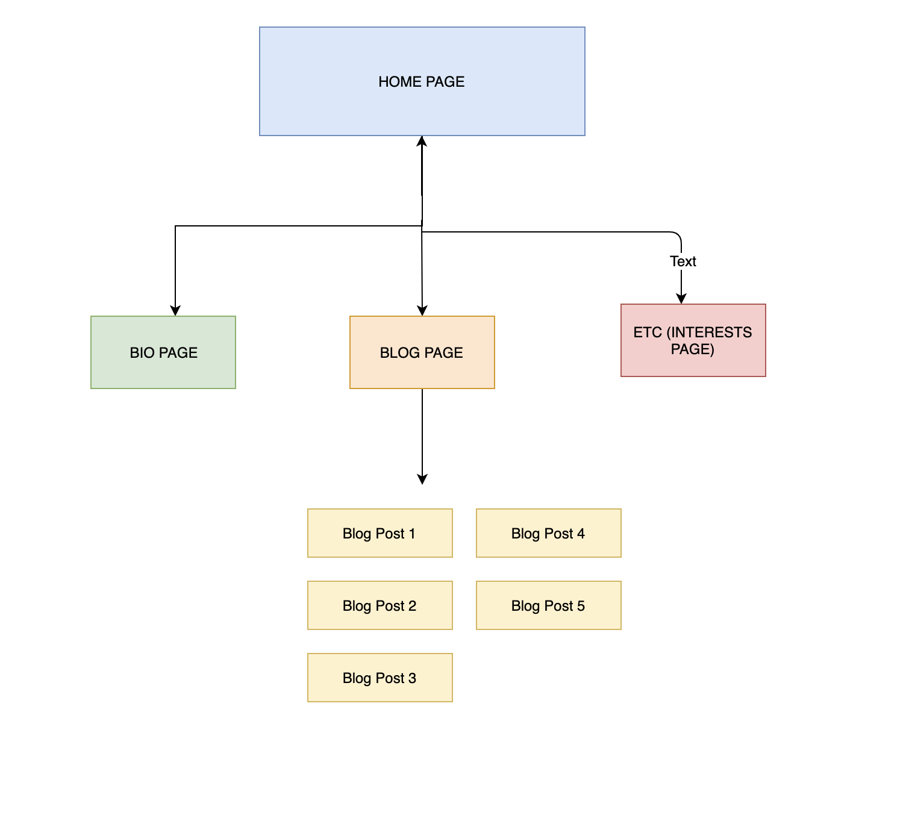
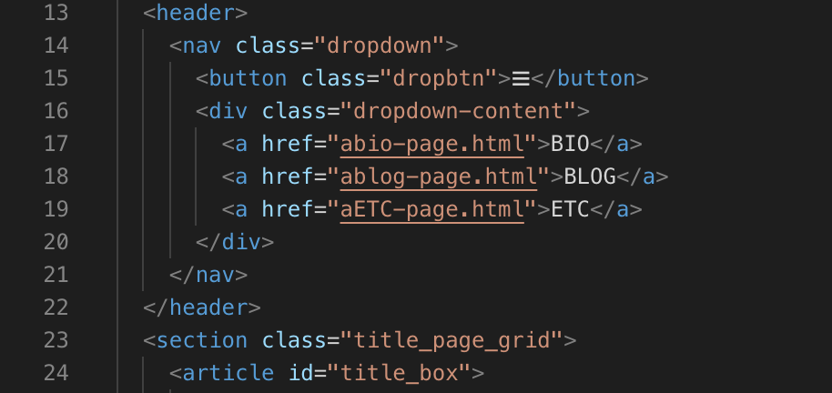
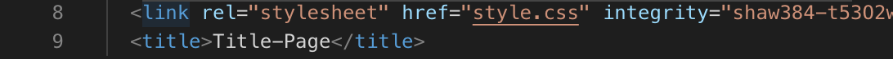
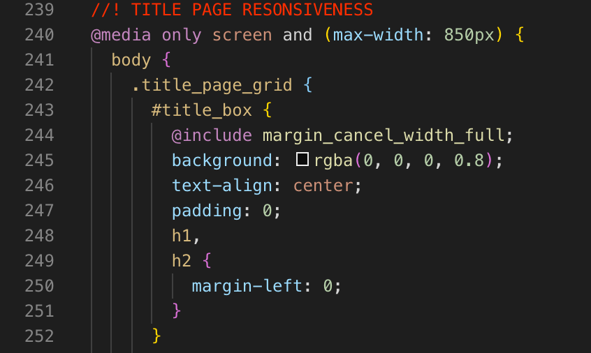
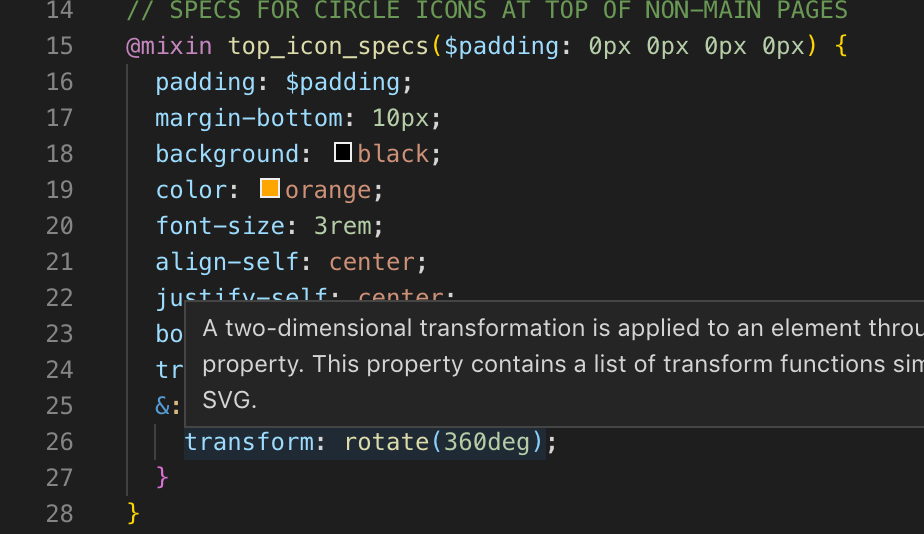
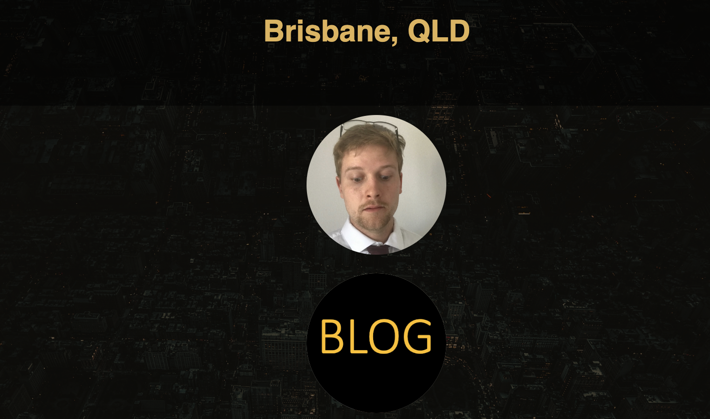
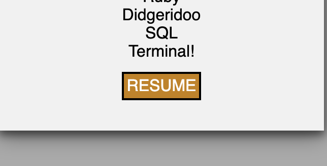
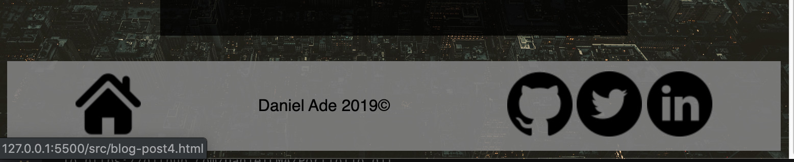

**Portfolio - Daniel Ade**

URL to my site: https://daniellma.github.io/Portfolio/

Github link: https://github.com/DanielLMA/Portfolio

PURPOSE

Create a means for potential employers or clients to contact me
Stay connected through social media with potential clients or colleagues
Exhibit a work history and background which also accentuates my strengths, skills and personality 

Each page was accesibility to the other through links and also a hamburger menu in the top right corner. 

HTML semantics were used for accesibility to ensure that individuals using a screen reader would be able to easily navigate the page by semantic sections. 

An SRI was produced to protect the integrity of the .css page on each HTML document. 

Media queries were added for different size devices for responsiveness. 

Mixins and also variables for colors, styles, and fonts were used to ensure that the document was concise and clear. Also, in-line comments were made (particularly on the .scss sheet) to ensure clarity for any who might use the sheet in the future, including it's author. 

Different compoent features were used including responsive items that changed with :hover. These included opacity changes and translation (linear and rotational). 

A hamburger icon with a drop down menu was used on each page for the viewer to have another means of navigation on the site. 

A link to the author's resume was incorporated for future prospective employers. 

A footer (and also nav bar) were created that could be used on various pages which help avoid redundancy. 

TECH STACK: Tech stack consisted of 9 HTML file pages, which included 4 main pages and 5 blog post pages. These were all intercontected through anchor links that made it easily accesible from one site to the other. All sites were styled by a single style.css sheet for continuity. This file was produced from a .scss sheet. 

Three different branches were made (which can be viewable on the Github platform) that each have a working branch and show a different working style. One included incorporating a green theme, instead of orange. The other was a change in font to a serif text. 

